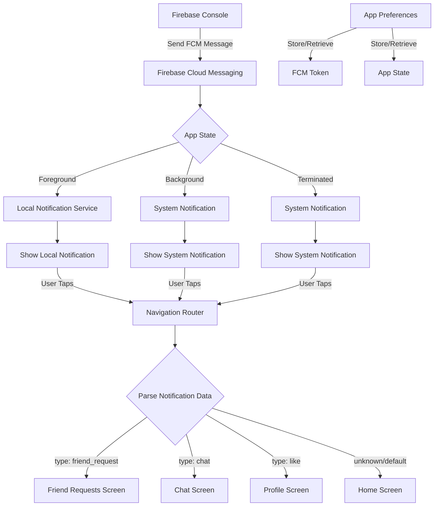
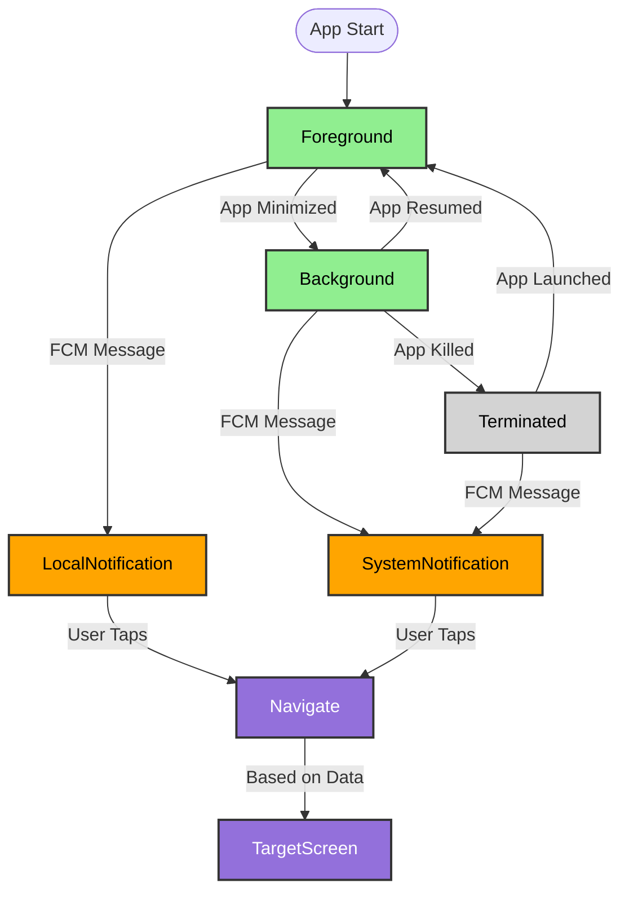

# Flutter Push Notifications Implementation

A comprehensive Flutter project demonstrating Firebase Cloud Messaging (FCM) integration with local notifications, navigation routing, and screen wake-up functionality.

## 📱 Features

- **Firebase Cloud Messaging (FCM)** integration
- **Local Notifications** for foreground messages
- **Smart Navigation Routing** based on notification data
- **Screen Wake-up** when notifications arrive
- **App State Persistence** using SharedPreferences
- **Multi-screen Navigation** with notification-driven routing

## 🏗️ Architecture Overview



## 🚀 Getting Started

### Prerequisites

- Flutter SDK (>=3.0.0)
- Firebase project setup
- Android/iOS development environment

### 1. Firebase Setup

1. **Create Firebase Project**

   ```bash
   # Visit https://console.firebase.google.com/
   # Create new project or use existing one
   ```

2. **Install Firebase CLI**

   ```bash
   npm install -g firebase-tools
   firebase login
   ```

3. **Configure Firebase for Flutter**
   ```bash
   flutter pub global activate flutterfire_cli
   flutterfire configure
   ```

### 2. Dependencies Installation

```bash
flutter pub get
```

**Dependencies used:**

```yaml
dependencies:
  firebase_core: ^4.0.0
  firebase_messaging: ^16.0.0
  flutter_local_notifications: ^18.0.1
  shared_preferences: ^2.5.3
```

### 3. Android Configuration

#### AndroidManifest.xml Setup

Location: `android/app/src/main/AndroidManifest.xml`

```xml
<activity
    android:name=".MainActivity"
    android:exported="true"
    android:launchMode="singleTop"
    android:showWhenLocked="true"
    android:turnScreenOn="true"
    android:windowSoftInputMode="adjustResize">
```

#### Gradle Configuration

Location: `android/app/build.gradle.kts`

```kotlin
android {
    compileSdk = 34

    compileOptions {
        isCoreLibraryDesugaringEnabled = true
        sourceCompatibility = JavaVersion.VERSION_11
        targetCompatibility = JavaVersion.VERSION_11
    }
}

dependencies {
    coreLibraryDesugaring("com.android.tools:desugar_jdk_libs:2.0.4")
}
```

### 4. iOS Configuration (Optional)

Add to `ios/Runner/Info.plist`:

```xml
<key>UIBackgroundModes</key>
<array>
    <string>remote-notification</string>
</array>
```

## 📂 Project Structure

```
lib/
├── main.dart                           # App entry point & FCM initialization
├── firebase_options.dart              # Firebase configuration
├── core/
│   ├── navigation/
│   │   └── app_router.dart            # Navigation routing & notification handling
│   └── services/
│       ├── app_prefs.dart             # SharedPreferences wrapper
│       ├── fcm_service.dart           # FCM token & listener management
│       └── local_notification_service.dart # Local notifications
└── features/
    ├── home/view/home_page.dart       # Home screen with navigation buttons
    ├── chat/view/chat_screen.dart     # Chat screen
    ├── friend_requests/view/friend_requests_screen.dart
    └── profile/view/profile_screen.dart
```

## 🔄 Notification Flow

### 1. App Lifecycle States



### 2. Notification Data Structure

Send notifications with this data format:

```json
{
  "notification": {
    "title": "Friend Request",
    "body": "John Doe sent you a friend request"
  },
  "data": {
    "type": "friend_request",
    "fromUserId": "user123",
    "requestId": "req456"
  }
}
```

### 3. Supported Notification Types

| Type             | Screen          | Required Data             |
| ---------------- | --------------- | ------------------------- |
| `friend_request` | Friend Requests | `fromUserId`, `requestId` |
| `chat`           | Chat Screen     | `chatId`, `fromUserId`    |
| `like`           | Profile Screen  | `userId`                  |
| Default          | Home Screen     | None                      |

## ⚡ Key Components

### FCM Service (`fcm_service.dart`)

- **Token Management**: Fetches and persists FCM tokens
- **Permission Handling**: Requests notification permissions
- **Lifecycle Listeners**: Handles foreground, background, and terminated states
- **Smart Token Caching**: Avoids unnecessary token fetches

### Local Notification Service (`local_notification_service.dart`)

- **Foreground Notifications**: Shows notifications when app is active
- **Screen Wake-up**: Turns on device screen for important notifications
- **Channel Configuration**: Sets up Android notification channels
- **Tap Handling**: Routes to appropriate screens when tapped

### Navigation Router (`app_router.dart`)

- **Data-driven Routing**: Navigates based on notification payload
- **Navigator Ready Check**: Waits for MaterialApp to be ready
- **Fallback Handling**: Defaults to home screen for unknown types

### App Preferences (`app_prefs.dart`)

- **Token Persistence**: Stores FCM tokens locally
- **Generic Storage**: Provides methods for string, bool, int, double storage
- **Singleton Pattern**: Ensures single instance across app

## 🧪 Testing

### 1. Send Test Notifications

Use Firebase Console or REST API:

```bash
curl -X POST https://fcm.googleapis.com/fcm/send \
  -H "Authorization: key=YOUR_SERVER_KEY" \
  -H "Content-Type: application/json" \
  -d '{
    "to": "FCM_TOKEN_HERE",
    "notification": {
      "title": "Test Notification",
      "body": "Testing navigation routing"
    },
    "data": {
      "type": "chat",
      "chatId": "chat123"
    }
  }'
```

### 2. Test Scenarios

1. **Foreground**: App open → Send notification → Local notification appears
2. **Background**: App minimized → Send notification → System notification → Tap → Navigate
3. **Terminated**: App closed → Send notification → System notification → Tap → App opens + Navigate

### 3. Debug Output

Check console for debug logs:

```
I/flutter: FCM token (existing): eGh4...
I/flutter: FCM onMessage (foreground): {...}
I/flutter: Navigating to type: chat with data: {type: chat, chatId: chat123}
```

## 🔧 Customization

### Adding New Notification Types

1. **Add route constant** in `app_router.dart`:

   ```dart
   static const newFeature = '/newFeature';
   ```

2. **Add navigation case**:

   ```dart
   case 'new_feature':
     nav.pushNamed(AppRoutes.newFeature, arguments: data);
     break;
   ```

3. **Register route** in `main.dart`:
   ```dart
   routes: {
     '/newFeature': (_) => const NewFeatureScreen(),
   }
   ```

### Modifying Notification Appearance

Edit `local_notification_service.dart`:

```dart
const AndroidNotificationDetails androidDetails = AndroidNotificationDetails(
  'channel_id',
  'Channel Name',
  importance: Importance.high,
  priority: Priority.high,
  enableLights: true,      // LED light
  enableVibration: true,   // Vibration
  fullScreenIntent: true,  // Wake screen
);
```

---

Built with ❤️ by Shishir Rijal using Flutter & Firebase
